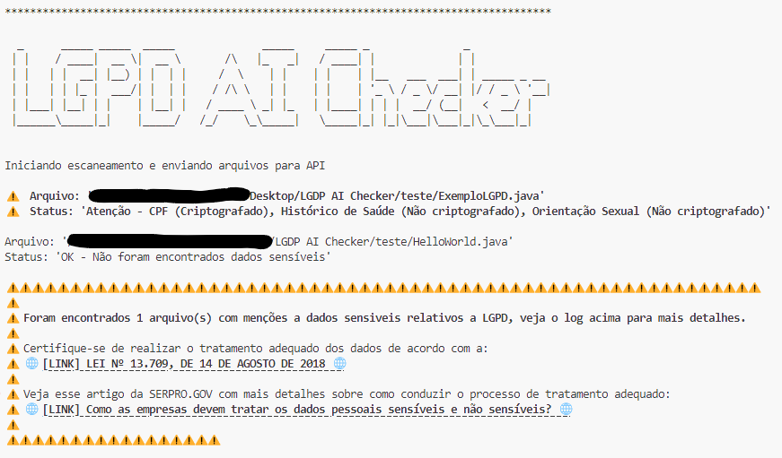

### [EN]
# LGPD AI Checker

LGPD AI Checker is an application built in Bash, designed to scan code files for mentions of sensitive data according to LGPD (Lei Geral de Proteção de Dados), the Brazilian General Data Protection Law. It leverages OpenAI's GPT-4 model to perform natural language processing on code files and identify sensitive data, subsequently generating a detailed report of the findings.

This tool can be integrated into DevSecOps CI/CD pipelines to automate compliance checking with LGPD during the software development lifecycle. By including LGPD AI Checker as part of the continuous integration/continuous deployment pipeline, you can ensure that sensitive data is identified early on and handled according to data protection requirements, promoting security and compliance with privacy regulations.

## Key Features

- **Code Scanning**: Analyzes various types of code files, including JSON, Java, C/C++, Python, and more.
- **Sensitive Data Identification**: Utilizes OpenAI's GPT-4 model to identify mentions of sensitive data within code files.
- **Flexibility**: Can be used for both manual assessments and integration into CI/CD pipelines.
- **Compliance Support**: Provides guidance on handling sensitive data in compliance with LGPD regulations.

## Usage

### Manual Assessments

For manual assessments:

1. Ensure that the `LGPD_AI_Checker` folder is placed in the root directory of the project to be scanned.

2. Run the `LGPD_AI_Checker.sh` script

3. Follow the prompts and review the generated log for any mentions of sensitive data.

### CI/CD Integration

To integrate LGPD AI Checker into CI/CD pipelines:

1. Ensure that the `LGPD_AI_Checker` folder is available within your CI/CD environment, either by including it in your version control system or by downloading it as part of your pipeline setup.

2. Configure your CI/CD pipeline to run the `LGPD_AI_Checker.sh` script as a step or task. This can typically be done by executing a shell command within your pipeline configuration.

3. Ensure that the pipeline is triggered appropriately, such as on code commits or scheduled intervals.

4. Monitor the pipeline execution and review the generated log for any mentions of sensitive data.

By following these steps, you can automate the process of scanning code files for sensitive data within your CI/CD pipelines, ensuring data protection and regulatory compliance throughout the development lifecycle.

## Log Examples

### Sensitive Data Found

## Contribution

Contributions are welcome! If you encounter any issues or have suggestions for improvements, please feel free to open an issue or submit a pull request.
If you found this project useful, maybe [buy me a coffee!](https://ko-fi.com/fbrenomoura) ☕️ and follow me for more [LinkedIn](https://linkedin.com/in/fbrenomoura/).

## License

This project is licensed under the MIT License.

## Disclaimer

LGPD AI Checker is provided as-is without any warranty. Use it responsibly and always verify the results to ensure compliance with data protection regulations.

### [PT-BR]
# LGPD AI Checker

LGPD AI Checker é uma aplicação construída em Bash, projetada para escanear arquivos de código em busca de menções a dados sensíveis de acordo com a LGPD (Lei Geral de Proteção de Dados), a Lei Geral de Proteção de Dados do Brasil. Utiliza o modelo GPT-4 da OpenAI para processamento de linguagem natural em arquivos de código e identificação de dados sensíveis, gerando posteriormente um relatório detalhado dos resultados.

Esta ferramenta pode ser integrada em pipelines de CI/CD DevSecOps para automatizar a verificação de conformidade com a LGPD durante o ciclo de vida de desenvolvimento de software. Ao incluir o LGPD AI Checker como parte do pipeline de integração contínua/distribuição contínua, você pode garantir que os dados sensíveis sejam identificados precocemente e tratados de acordo com os requisitos de proteção de dados, promovendo a segurança e a conformidade com regulamentos de privacidade.

## Principais Recursos

- **Escaneamento de Código**: Analisa vários tipos de arquivos de código, incluindo JSON, Java, C/C++, Python e outros.
- **Identificação de Dados Sensíveis**: Utiliza o modelo GPT-4 da OpenAI para identificar menções a dados sensíveis nos arquivos de código.
- **Flexibilidade**: Pode ser utilizado tanto para avaliações manuais quanto para integração em pipelines CI/CD.
- **Suporte de Conformidade**: Oferece orientações sobre o manuseio de dados sensíveis em conformidade com as regulamentações da LGPD.

## Uso

### Avaliações Manuais

Para avaliações manuais:

1. Certifique-se de que a pasta `LGPD_AI_Checker` esteja localizada no diretório raiz do projeto a ser escaneado.

2. Execute o script `LGPD_AI_Checker.sh`.

3. Siga as instruções e revise o log gerado em busca de menções a dados sensíveis.

### Integração CI/CD

Para integrar o LGPD AI Checker em pipelines CI/CD:

1. Certifique-se de que a pasta `LGPD_AI_Checker` esteja disponível em seu ambiente CI/CD, seja incluindo-a em seu sistema de controle de versão ou baixando-a como parte da configuração do pipeline.

2. Configure seu pipeline CI/CD para executar o script `LGPD_AI_Checker.sh` como uma etapa ou tarefa. Isso geralmente pode ser feito executando um comando de shell dentro da configuração do seu pipeline.

3. Garanta que o pipeline seja acionado adequadamente, por exemplo, em commits de código ou intervalos programados.

4. Monitore a execução do pipeline e revise o log gerado em busca de menções a dados sensíveis.

Seguindo esses passos, você pode automatizar o processo de escaneamento de arquivos de código em busca de dados sensíveis dentro de seus pipelines CI/CD, garantindo proteção de dados e conformidade regulatória ao longo do ciclo de desenvolvimento.

## Exemplo de log

### Dados sensiveis encontrados

## Contribuição

Contribuições são bem-vindas! Se você encontrar algum problema ou tiver sugestões para melhorias, sinta-se à vontade para abrir uma issue ou enviar um pull request.
Se você achou este projeto útil, talvez queira [me pagar um café!](https://ko-fi.com/fbrenomoura) ☕️ e me seguir para mais [LinkedIn](https://linkedin.com/in/fbrenomoura/).

## Licença

Este projeto está licenciado sob a Licença MIT.

## Aviso Legal

O LGPD AI Checker é fornecido "no estado em que se encontra", sem qualquer garantia. Use-o de forma responsável e sempre verifique os resultados para garantir conformidade com as regulamentações de proteção de dados.
